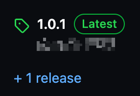

# Artisticly Server
This is the server that allows the app [Artisticly](https://github.com/lumaa-dev/ArtisticlyClient) to run properly.

## About song files
All songs must use the `.mp3`, `.wav` or `.m4a` format.

The naming comes like this `[song-id]-[0 = hidden, 1 = public]-[anything you want]`, the song id is an integer\
Public songs are accessible by any user, while hidden songs are only accessible via the access code set in the [`config.json` file](config.json).

## How to run your own server
Beforehand, you need **npm and node** on your computer or server.

1. Click on the [latest release](https://github.com/lumaa-dev/ArtisticlyServer/releases/latest) like shown below:\
\
And download the *ArtisticlyServer.zip*, then unzip it.

2. Edit the [`config.json` file](config.json) by putting your own access code and name. Don't forget to set `configured` to `true`!

3. You can now run the server by doing `npm install` then `node server.js`, et voilà!

Then simply do the according settings in the [Artisticly app](https://github.com/lumaa-dev/ArtisticlyClient).